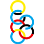

## Airline Logos

**AirlineLogoScraper** is a script that iterates through all three-character alphanumeric codes and attempts to download the corresponding airline logo from [FlightAware](http://flightaware.com). 

For example, Delta Airlines has the ICAO code **DAL**. The script downloads the logo from `https://flightaware.com/images/airline_logos/90p/DAL.png`.

### Running AirlineLogoScraper

Download the `AirlineLogoScraper` executable and double-click on it (or run it through terminal with `$ ./AirlineLogoScraper`). It will create the logos into `~/Documents/Airline Logos`.

### All Logos

As of 4 Oct 2017, the script yields 150 distinct logos.

| ICAO code | image               |
| ------- | --------------------- |
| **AAA** |  |
| **AAH** |  |
| **AAL** |  |
| **AAR** |  |
| **ACA** |  |
| **AFL** |  |
| **AFR** |  |
| **AIC** |  |
| **AIJ** |  |
| **AJM** |  |
| **ALK** |  |
| **AMC** |  |
| **AMT** |  |
| **AMU** |  |
| **AMX** |  |
| **ANA** |  |
| **ANZ** |  |
| **ARG** |  |
| **ASA** |  |
| **ASQ** |  |
| **ATC** |  |
| **AUA** |  |
| **AVA** |  |
| **AWE** |  |
| **AZA** |  |
| **AZU** |  |
| **BAW** |  |
| **BEE** |  |
| **BER** |  |
| **BLC** |  |
| **BMA** |  |
| **BOE** |  |
| **BTA** |  |
| **BWA** |  |
| **CAL** |  |
| **CCA** |  |
| **CES** |  |
| **CHH** |  |
| **CJT** |  |
| **CLH** |  |
| **CLX** |  |
| **CMP** |  |
| **COA** |  |
| **CPA** |  |
| **CSA** |  |
| **CSC** |  |
| **CSN** |  |
| **CSZ** |  |
| **CXA** |  |
| **DAL** |  |
| **DLH** |  |
| **EAL** |  |
| **EDV** |  |
| **EGF** |  |
| **EIN** |  |
| **ELY** |  |
| **ENY** |  |
| **ETD** |  |
| **ETH** |  |
| **EVA** |  |
| **EWG** |  |
| **EZY** |  |
| **FDX** |  |
| **FFT** |  |
| **FIN** |  |
| **FJI** |  |
| **FLG** |  |
| **FWR** |  |
| **GEC** |  |
| **GFA** |  |
| **GIA** |  |
| **GLO** |  |
| **GTI** |  |
| **HAL** |  |
| **HTL** |  |
| **IBE** |  |
| **ICE** |  |
| **JAL** |  |
| **JAT** |  |
| **JBU** |  |
| **JKK** |  |
| **JMC** |  |
| **JSX** |  |
| **JZA** |  |
| **KAL** |  |
| **KLM** |  |
| **LAL** |  |
| **LAN** |  |
| **LDA** |  |
| **LGL** |  |
| **LNI** |  |
| **LOF** |  |
| **LOT** |  |
| **LTD** |  |
| **LTG** |  |
| **LTU** |  |
| **MAS** |  |
| **MEP** |  |
| **MGL** |  |
| **MPG** |  |
| **MPH** |  |
| **MSR** |  |
| **MXA** |  |
| **NGE** |  |
| **NKS** |  |
| **NMB** |  |
| **NRL** |  |
| **NWA** |  |
| **OAL** |  |
| **OZW** |  |
| **PAC** |  |
| **PAL** |  |
| **PGA** |  |
| **PIA** |  |
| **POE** |  |
| **PWD** |  |
| **QFA** |  |
| **QTR** |  |
| **ROU** |  |
| **RSP** |  |
| **RVF** |  |
| **RYR** |  |
| **SAA** |  |
| **SAS** |  |
| **SCX** |  |
| **SIA** |  |
| **SKV** |  |
| **SKW** |  |
| **SLI** |  |
| **SLM** |  |
| **SRY** |  |
| **SVA** |  |
| **SWA** |  |
| **SWG** |  |
| **SWR** |  |
| **TAI** |  |
| **TAM** |  |
| **TAP** |  |
| **THA** |  |
| **THY** |  |
| **TRS** |  |
| **UAE** |  |
| **UAL** |  |
| **USA** |  |
| **VIR** |  |
| **VOI** |  |
| **VOZ** |  |
| **VRD** |  |
| **VRG** |  |
| **WJA** |  |
